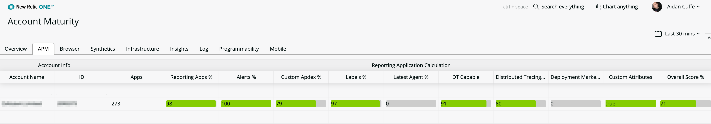

[](https://github.com/newrelic/open-source-office/blob/master/examples/categories/index.md#nr1-catalog)

# New Relic One - Account Maturity

  [](https://snyk.io/test/github/newrelic/nr1-nerdpack-layout-standard)

Account Maturity for New Relic One is a quick view that helps you understand what key features of your New Relic account you're using across multiple accounts and applications. It uses the power of the [NerdGraph API](https://docs.newrelic.com/docs/apis/nerdgraph/get-started/introduction-new-relic-nerdgraph) to explore the account structure and provide detailed information for master and subaccounts, and their usage.

The goal of this app is to highlight functionalities which perhaps you are not aware of, or are disabled. As a guide, its scores should be taken as an advice. We don't expect the majority of users of this app to achieve 100% scores.

Currently, Account Maturity tracks the following New Relic products:

- APM 
- Browser 
- Synthetics
- Mobile
- Infrastructure
- Insights
- Logs
- Programmability

As this app evolves and more data is exposed through NerdGraph, we will be adding more indicators and metrics and products. You're welcome to contribute!

## Install

1. Ensure that you have [git](https://git-scm.com/book/en/v2/Getting-Started-Installing-Git) and [npm](https://www.npmjs.com/get-npm) installed. If you're unsure whether you have one or both of them installed, run the following commands (they will return versions numbers):
```bash
git --version
npm -v
```
2. Install the [New Relic One CLI](https://one.newrelic.com/launcher/developer-center.launcher). Follow the instructions to set up your New Relic development environment.

3. Clone this repository and run the code locally against your New Relic data:
```bash
nr1 nerdpack:clone -r https://github.com/newrelic/nr1-account-maturity.git
cd nr1-account-maturity
npm install
nr1 nerdpack:serve
```
4. Visit [https://one.newrelic.com/?nerdpacks=local](https://one.newrelic.com/?nerdpacks=local), navigate to the application, and :sparkles: enjoy!

## Deployment

To deploy Account Maturity, open a terminal session in the application directory and run the following commands:

```bash
# If you need to create a new uuid for the account to which you're deploying this Nerdpack, use the following
# nr1 nerdpack:uuid -g [--profile=your_profile_name]
# to see a list of APIkeys / profiles available in your development environment, run nr1 credentials:list
nr1 nerdpack:publish [--profile=your_profile_name]
nr1 nerdpack:deploy [-c [DEV|BETA|STABLE]] [--profile=your_profile_name]
nr1 nerdpack:subscribe [-c [DEV|BETA|STABLE]] [--profile=your_profile_name]
```
If you want the Account Maturity app to be able to see subaccounts, deploy at the master account level. It will only show data from accounts that a user is named/permitted on, so users of subaccount B won't be able to see sub-account A if they are not named users on that account. 

## Usage

The Overview helps you see quickly where improvements could potentially be made across the product sets you might be using. With that information perhaps we might click into APM to learn a bit more.


Each tab lets you see a breakdown of how the score is calculated. We've weighted the features based on our opinion of importance out of the box. In the future we aim at exposing the weightings to allow you to change or omit metrics that may not be relevant to your organisation.



Each column on the table containes a metric and the evaluation we gave it for that account. To identify areas for improvement, click on the row of an account. The resulting drilldown is available for APM, Browser, and Synthetics, and we will add this to Mobile and to specific metrics on demand where the metric has a breakdown (some metrics are at account level and cannot be split any lower).


Within the drilldown there's lots of useful and actionable information. This now shows you the entity within that account and whether it was using the feature or function we are calculating in the metric. You can quickly sort your entities by that column and find which entities are dragging your score down.

## Contributing

Contributions are welcome (and if you submit a Enhancement Request, expect to be invited to contribute it yourself :grin:). Please review our [Contributors Guide](CONTRIBUTING.md).

Keep in mind that when you submit your pull request, you'll need to sign the CLA via the click-through using CLA-Assistant. If you'd like to execute our corporate CLA, or if you have any questions, please drop us an email at opensource+maturity@newrelic.com

## Support

New Relic has open-sourced this project. This project is provided AS-IS WITHOUT WARRANTY OR DEDICATED SUPPORT. Issues and contributions should be reported to the project here on GitHub.

We encourage you to bring your experiences and questions to the [Explorers Hub](https://discuss.newrelic.com) where our community members collaborate on solutions and new ideas.

### Community

New Relic hosts and moderates an online forum where customers can interact with New Relic employees as well as other customers to get help and share best practices. Like all official New Relic open source projects, there's a related Community topic in the New Relic Explorers Hub. You can find this project's topic/threads here:

[https://discuss.newrelic.com/t/new-relic-account-maturity-nerdpack/101542](https://discuss.newrelic.com/t/new-relic-account-maturity-nerdpack/101542)

### Issues / Enhancement Requests

Issues and enhancement requests can be submitted in the [Issues tab of this repository](https://github.com/newrelic/nr1-account-maturity/issues). Please search for and review the existing open issues before submitting a new issue.

## <a name='License'></a>License

The project is released under version 2.0 of the [Apache license](http://www.apache.org/licenses/LICENSE-2.0).
