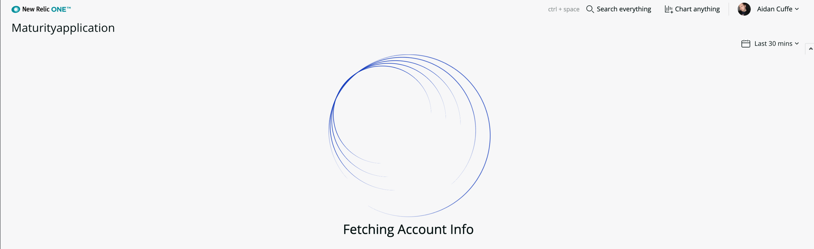

# New Relic - Account Maturity
 [](https://snyk.io/test/github/newrelic/nr1-nerdpack-layout-standard)

This New Relic One app is designed to make use of some of the available APIs to understand how well you may be using your account and the features that may provide value to you within New Relic's services. It uses the power of the GraphQL API to understand account structure and can provide some detailed information for master and sub-accounts and how they are being utilised.

The goal of this app is not to create a critical voice on your account usage but to highlight functionality which perhaps you were not aware was un-used or disabled. It is a guide and the scores are merely a guage alongside to provide a measure. We don't expect the majority of the users of this app to achieve 100% scores but they certainly can be goals for a number of the important features.

#### What's included?
- APM Feature Usage
- Browser Feature Usage

Further products will be added as this app evolves.

## Usage

The usage of this New Relic App is quite simple. Follow the Getting Started guide to publish, deploy and subscribe your account to this Nerdpack. If you want the app to be able to see sub-accounts, deploy at the master account level. It will only show data from accounts that a user is named/permitted on, so users of a sub-account B won't be able to see sub-account A if they are not named users on that account. 



### Open Source License

This project is distributed under the [Apache 2 license](LICENSE).

### What do you need to make this work?
Nothing! Just follow the getting started instructions below :).

### Getting started
1. First, ensure that you have [Git](https://git-scm.com/book/en/v2/Getting-Started-Installing-Git) and [NPM](https://www.npmjs.com/get-npm) installed. If you're unsure whether you have one or both of them installed, run the following command(s) (If you have them installed these commands will return a version number, if not, the commands won't be recognized):
```bash
git --version
npm -v
```
2. Next, install the [NR1 CLI](https://one.newrelic.com/launcher/developer-center.launcher) by going to [this link](https://one.newrelic.com/launcher/developer-center.launcher) and following the instructions (5 minutes or less) to install and setup your New Relic development environment.
3. Next, to clone this repository and run the code locally against your New Relic data, execute the following command:

```bash
nr1 nerdpack:clone -r https://github.com/newrelic/nr1-nerdpack-layout-standard.git
cd nr1-nerdpack-layout-standard
nr1 nerdpack:serve
```

Visit [https://one.newrelic.com/?nerdpacks=local](https://one.newrelic.com/?nerdpacks=local), navigate to the Nerdpack, and :sparkles:

### Deploying this Nerdpack

Open a command prompt in the nerdpack's directory and run the following commands.

```bash
# If you need to create a new uuid for the account to which you're deploying this Nerdpack, use the following
# nr1 nerdpack:uuid -g [--profile=your_profile_name]
# to see a list of APIkeys / profiles available in your development environment, run nr1 credentials:list
nr1 nerdpack:publish [--profile=your_profile_name]
nr1 nerdpack:deploy [-c [DEV|BETA|STABLE]] [--profile=your_profile_name]
nr1 nerdpack:subscribe [-c [DEV|BETA|STABLE]] [--profile=your_profile_name]
```

Visit [https://one.newrelic.com](https://one.newrelic.com), navigate to the Nerdpack, and :sparkles:

## Support

New Relic has open-sourced this project. This project is provided AS-IS WITHOUT WARRANTY OR DEDICATED SUPPORT. Issues and contributions should be reported to the project here on GitHub.

We encourage you to bring your experiences and questions to the [Explorers Hub](https://discuss.newrelic.com) where our community members collaborate on solutions and new ideas.

### Community

New Relic hosts and moderates an online forum where customers can interact with New Relic employees as well as other customers to get help and share best practices. Like all official New Relic open source projects, there's a related Community topic in the New Relic Explorers Hub. You can find this project's topic/threads here:

https://discuss.newrelic.com/t/standard-layouts/88605

### Issues / Enhancement Requests

Issues and enhancement requests can be submitted in the [Issues tab of this repository](../../issues). Please search for and review the existing open issues before submitting a new issue.

### Contributing

Contributions are welcome (and if you submit a Enhancement Request, expect to be invited to contribute it yourself :grin:). Please review our [Contributors Guide](CONTRIBUTING.md).

Keep in mind that when you submit your pull request, you'll need to sign the CLA via the click-through using CLA-Assistant. If you'd like to execute our corporate CLA, or if you have any questions, please drop us an email at opensource+maturity@newrelic.com
