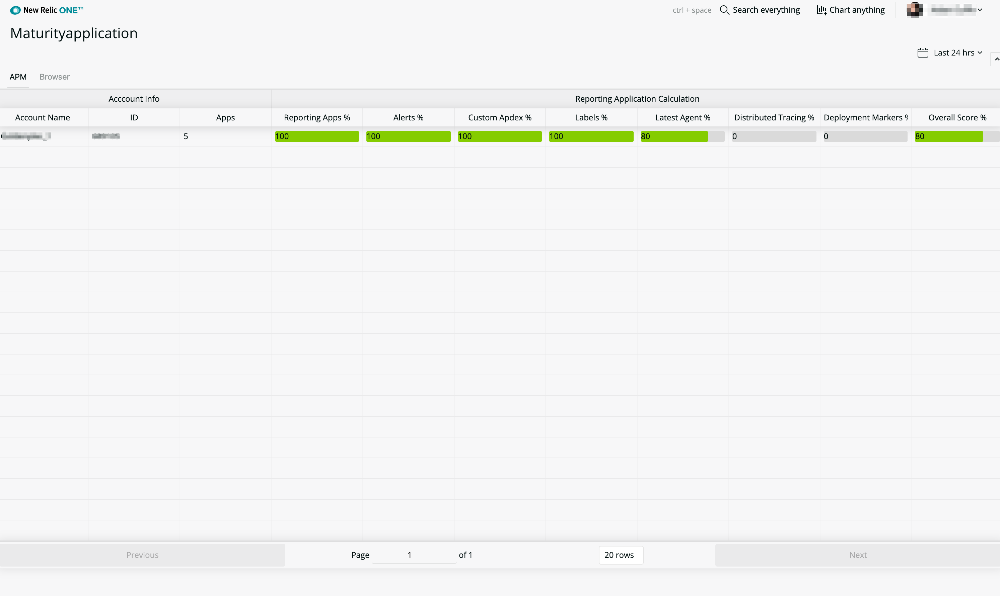
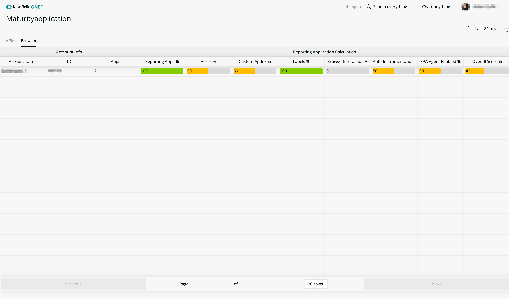
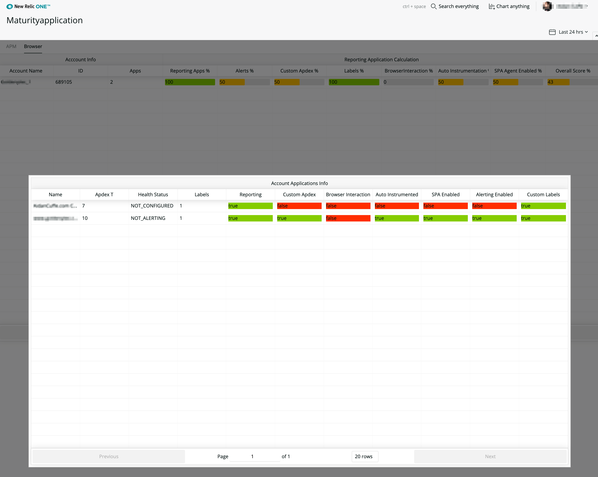

# New Relic - Account Maturity
 [](https://snyk.io/test/github/newrelic/nr1-nerdpack-layout-standard)

This New Relic One app uses available APIs to help you understand how well you're using your account and the New Relic features that might provide value to you. The app uses the power of the GraphQL API to understand your account structure and provides detailed information for master and sub-accounts, acting as a guide with scores that measure utilization.

The goal of this app is not to critique your account usage, but to highlight unused or disabled functionality that you might not be aware of. We don't expect the majority of those using this app to achieve 100% scores, but it will enable you to set usage goals for features that are important to you.

#### What's included?
- APM feature usage
- Browser feature usage

Further products will be added as this app evolves. Synthetics, Mobile, Alerts, Insights, Infrastructure we hope to add metrics which capture the usage of key features in each product to ensure maximum value from your New Relic account.

## Usage

The usage of this New Relic App is quite simple. Follow the **Getting Started** guide to publish, deploy, and subscribe your account to this Nerdpack. If you want the app to be able to see sub-accounts, deploy at the master account level. It will only show data from accounts that a user is named/permitted on, so users of a sub-account B won't be able to see sub-account A if they are not named users on that account. 


When the loading swirls appear as above, it means the Nerdlet has begun to check for all accounts in your account structure and to gather some useful data for your usage.

This latest version collates data about your accounts usage for APM and Browser. Eventually, we want to add all New Relic products to the Account Maturity Nerdpack.



The above screenshot shows a single account and breaks down feature usage to a score. 0-29 is colored red. 30-69 is colored orange, and 70-100 is green. 

The aim of the Account Maturity Nerdpack is to highlight opporunities to get further value from your account and ensure that across multiple accounts and applications, key features are enabled and in use by your teams.



The Browser metrics are similar to APM metrics, providing red, orange, and green scores on Browser features.



When you click on any of the rows that are score summaries for an entire account, you get a breakdown view that quickly shows which apps are contributing to a poor score. This makes your life so much easier if you have multiple sub-accounts and need to keep an eye on how different teams are using New Relic and enabling key features.

**Should I aim for a 100 score?**
The scores are a guideline, not a requirement. Some of the metrics might be for features that aren't as necessary for your particular project. However, for key features you want your team to use, the app shows you if they've been configured and are reporting to the account.

### Open Source License
This project is distributed under the [Apache 2 license](LICENSE).

### What do you need to make this work?
Nothing! Just follow the getting started instructions below.

### Getting started
1. Ensure that you have [Git](https://git-scm.com/book/en/v2/Getting-Started-Installing-Git) and [NPM](https://www.npmjs.com/get-npm) installed. If you're unsure whether you have one or both of them installed, run the following commands. (If you have them installed these commands will return a version number; if not, the commands won't be recognized.)
```bash
git --version
npm -v
```
2. Install the [NR1 CLI](https://one.newrelic.com/launcher/developer-center.launcher) by going to [this link](https://one.newrelic.com/launcher/developer-center.launcher) and following the instructions (5 minutes or less) to install and set up your New Relic development environment.
3. Run the following command to clone this repository and run the code locally against your New Relic data:

```bash
nr1 nerdpack:clone -r https://github.com/newrelic/nr1-account-maturity.git
cd nr1-nerdpack-layout-standard
nr1 nerdpack:serve
```

Visit [https://one.newrelic.com/?nerdpacks=local](https://one.newrelic.com/?nerdpacks=local), navigate to the Nerdpack, and :sparkles:

Remember that when serving a Nerdpack it will default load for the account you set as your default profile. If you are handling multiple accounts through your NR1 CLI you can use `nr1 profiles:default` and select a different profile to be your default.

### Deploying this Nerdpack

Open a command prompt in the nerdpack's directory and run the following commands.

```bash
# If you need to create a new uuid for the account to which you're deploying this Nerdpack, use the following
# nr1 nerdpack:uuid -g [--profile=your_profile_name]
# to see a list of APIkeys / profiles available in your development environment, run nr1 credentials:list
nr1 nerdpack:publish [--profile=your_profile_name]
nr1 nerdpack:deploy [-c [DEV|BETA|STABLE]] [--profile=your_profile_name]
nr1 nerdpack:subscribe [-c [DEV|BETA|STABLE]] [--profile=your_profile_name]
```

Visit [https://one.newrelic.com](https://one.newrelic.com), navigate to the Nerdpack, and :sparkles:

## Support

New Relic has open-sourced this project. This project is provided AS-IS WITHOUT WARRANTY OR DEDICATED SUPPORT. Issues and contributions should be reported to the project here on GitHub.

We encourage you to bring your experiences and questions to the [Explorers Hub](https://discuss.newrelic.com) where our community members collaborate on solutions and new ideas.

### Community

New Relic hosts and moderates an online forum where customers can interact with New Relic employees as well as other customers to get help and share best practices. Like all official New Relic open source projects, there's a related Community topic in the New Relic Explorers Hub. You can find this project's topic/threads here:

https://discuss.newrelic.com/t/standard-layouts/88605

### Issues / enhancement requests

Submit issues and enhancement requests in the [Issues tab of this repository](../../issues). Please search for and review the existing open issues before submitting a new issue.

### Contributing

Contributions are welcome (and if you submit a enhancement Request, expect to be invited to contribute it yourself. Please review our [Contributors Guide](CONTRIBUTING.md).

Keep in mind that when you submit your pull request, you'll need to sign the CLA via the click-through using CLA-Assistant. If you'd like to execute our corporate CLA, or if you have any questions, please drop us an email at opensource+maturity@newrelic.com
