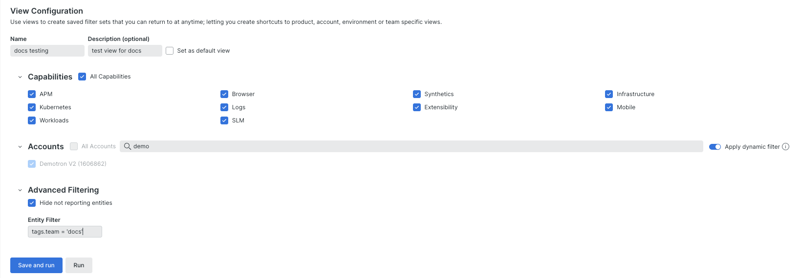
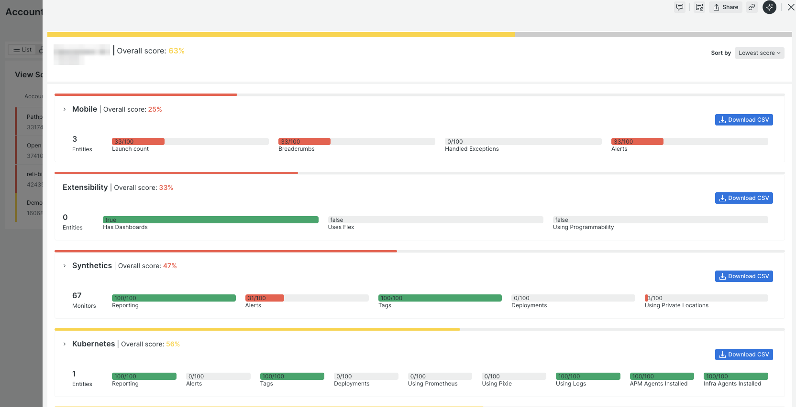
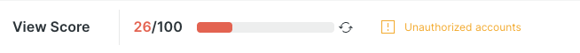

# Account Maturity User Guide

- [Usage Guide](#usage-guide)
- [Scoring Rules](#scoring-rules)
- [Key Concepts](#key-concepts)

## Usage Guide

- [First time access](#using-the-app-for-the-first-time)
- [See all Views](#see-all-views)
- [Configure a View](#configure-a-view)
- [View Summary](#view-summary-page)
- [View Detail](#view-detail-page)
- [Get Help](#get-help)

### Using the app for the first time

If it’s your first time using the Account Maturity app, you will first be presented with a welcome message and the opportunity to create a new View.

Views are saved configurations that allow you to create reusable filters to target specific data sets, and are the central concept that powers the app - please see [Configure a View](#configure-a-view) for full details on setting up a View.

If other Views have been configured by other users, a `See all views` button will be available, allowing you to access the list of existing View configurations rather than setting up your own.

### See all views

The **See all views** screen shows the listing of all Views that have been configured, by you and by other users. To see Views for different accounts, change the account selected in the platform account dropdown at the top of the screen.

Use the search bar above the table to locate a specific view by name.

The results table immediately surfaces useful information regarding the view, including when a score was last generated (**Last run**), what the latest score was (**Last score**) and how it changed from the previous score (**Last % score change**) - use these to understand overall progress and to determine if a new run of the View is required to record the latest score.

To open the View, simply click on the View's row. You can also select the **Run** option from the action menu (`...`) found at the end of the row. From this menu, you can also **edit** the configuration, or **delete** the view entirely.

Click the star on a row to favorite that View and ensure it is listed at the top of the table.

You will always see in this list a special View called **All Data**. The All Data view is automatically created for you, and is scoped specifically to your data - since different users have different “all data” scopes, determined by their individual access permissions, your All Data view is unique to you and can’t be seen by others.

### Configure a View

Create a new View by clicking the `New View` button. The `New View` button is available on both the **See all views** page and the **View Summary Page**.

**Important Note:** The View will be created in the currently selected account. To change change the account, pick the desired account from the platform account dropdown at the top of the screen, and reinitiate the New View process. The account used during creation determines who is able to access it: any user with both access to the account and to Account Maturity will be able to see this View. Any user without access to the account will not be able see it. Note that this does not restrict the data that is included in the View, as Account Maturity is able to show data across accounts. For more information on access permissions, see [Access and Permissions](#access-permissions).

Edit an existing View by selecting the **Update View** option from the `...` menu of the **View Summary Page**, or by selecting the **Edit** option from the `...` menu for the appropriate row in the **See all views** page.

Both these actions will open the the **View Configuration** screen, which allows you to define metadata for the View, and the filters it will use to locate the target data set. For performance reasons, it is highly recommended to narrow the scope of your View as much as possible. Views that target large sets of data may not be able to load, or may take a very long time to load.

A name for the View is required in order to save the configuration - if you need to generate a one-time temporary report, you can leave this field blank. If you would like this View to be loaded automatically when you open the app (as opposed to the **See all views** page), check the `Set as default view` checkbox.

Use the Capabilities, Accounts and Advanced Filtering selections to target a subset of data.

**Capabilities** allows you to focus only on those aspects of the New Relic platform that are relevant for your Account Maturity improvement plan (a subset of product capabilities are currently included). For instance, if you don’t collect Mobile data into New Relic, you can exclude it from any scoring reports and prevent it from impacting the overall scoring.

The **Accounts** section lets you target specific accounts to include in the report. You can use the search bar to quickly filter the list of accounts by name. If you use a naming convention to identify accounts, you can use the **dynamic filter** feature to automatically include all accounts that use that naming convention. Any accounts that are subsequently added using that convention will be included in any scoring reports going forward - there is no need to update the View configuration manually to include them.

Use the **Advanced Filtering** options to include non-reporting entities in your reports (they are excluded by default), or to apply a tag filter to further refine the scope of entities included. A tag filter is simply a NRQL-compliant query string specifying the tag and target value, for instance: `tag.env = 'uat'`.

The example configuration above targets all product capabilities for accounts that include the term "Demo", and which are owned by the docs team.

Once the filters are configured, click either `Save and Run` or `Run` to generate a score.

The `Save & Run` button is disabled until all mandatory properties are entered, or one of the properties for an existing View is changed. Clicking `Save & Run` will save the View definition, and make it available to other users. Once saved, a **score snapshot** will be generated. A score snapshot is a score result that is permenently saved and contributes to trend analytics for the View.

The `Run` option is always available. Clicking `Run` does not save any changes to the View configuration, and generates a **transient score** - these are score results that are not saved and do not contribute to trend analytics. Use `Run` to preview a configuration before saving, or to temporarily adjust filter settings.

Whether you click `Save and run` or `Run`, you will end up on the **View Summary Page**, presented with the scored results.

**Note** - views are capped at 50k entities. If you have a view that exceeds this target, you will need to apply additional filters to reduce the number of scoped entities. This cap is in place to ensure performance and stability.

### View Summary Page

The summary page presents the overall score results - either a transient score or a score snapshot - for a View configuration. Let’s walk through this page in detail.

#### Layout Options

At the top of the page, you will have several options to affect how the data is presented.

1. List view shows you the data in tabular format. The table shows the overall score for each capability per account, ordered by worst to best aggregate account score. **List view is only available when grouping by account** (see Grouping Options below). Click on the account or capability name to open the Detail Page
2. Summary view shows the data in card format, providing an executive overview of the results highlighting problem areas. Click on the tile to open the Detail Page.
3. Navigator view is a very data dense visualization, helpful when there is a large number of entities included in the View configuration. Click on the tile to open the Detail Page.
4. Trends is a series of charts showing the changes in scoring over time, based on the recorded score snapshots. Note that snapshots are only generated when a View is loaded, therefore the time intervals available for the trend charts may be inconsistent.

#### Grouping Options

You can choose to group the data either by account, or by capability.

When grouping by account, you will see the scores for each capability in the account, with the account assigned an aggregate score (the average across all the capabilities).

When grouping by capability, you will see the scores for each account for that capability, with the capability assigned an aggregate score (the average across all the accounts).

#### Additional Actions

Regardless of the selected layout (with the exception of Trends) or grouping, there are common features that will always be available.

The `Views` dropdown allows you to quickly navigate to another View, or to open **See all views**, to display the comprehensive listing of all Views available to you.

The more (`...`) button provides some admin options affecting the current view:

- **Update view** will take you to the View configuration page
- **Set as default** allows you to set this View as the default page to load when opening the app (this is not available when there are unsaved changes for the View)
- **Delete snapshot** is available when multiple score snapshots have been saved for this View. Selecting this will delete the currently loaded snapshot, and load the next most recent snapshot.
- **Delete** will completely delete the View configuration and any snapshots, and return you to the View list page. Delete is not available for the All Data View.

Located directly below the actions bar, you will find additional actions associated directly to the View.

An average score for the View is always presented at the top of the results section. Next to this overall score is the `Refresh` button, which allows you to manually generate a **score snapshot**.

If multiple snapshots have been recorded, you can load a previous snapshot from the `Show scores from` dropdown.

Finally, use the `Download CSV` feature to create a CSV-formatted export of the summary results.

### View Detail Page

Each entry on the summary page has a detailed drill-down. To access the detail page, click on the table row in the List layout, or the tile in the Summary or Navigator layouts.

This opens the detailed scoring results for that account or capability (depending on the active grouping selected on the **View Summary Page**).

The Detail Page presents the overall score for each account/capability, sorted by default from lowest score to highest (reverse the sorting using the `Sort by` dropdown).

For rapid scanning, each section is minimized by default, with only its scoring overview and the option to download to CSV visible.

Click on the name of a section to expand it. This will additionally show the individual results for each element that contributed to the overall score.

Each capability is evaluated based on it's own scoring rules, with every applicable entity individually scored against those rules.

Along the top of the section, we can how many entities were evaluated in the section, and the overall score attained for each rule.

In the section below, we can see every entity in tabular format, and how it individually scored on each rule.

For instance, in this example above, we are using the Account grouping and have expanded the results for APM in our demo account (if we had been looking at grouping by capability, the sections would represent each account scored against the rules for that capability).

From the overall scores, I can see at a glance the areas for improvement: we need to better tailor our apdex settings on an individual app basis; our agents are all out of date; we can leverage distrubted tracing more comprehensively; and we should start tracking our deployments.

On the other hand, we have alerting coverage on all our APM entities, we are leveraging tagging and logs in context, and are adding custom attributes on our transactions for enhanced context.

So - overall not terrible, but definitely a lot of room for improvement, which explains the aggregate score of 58%.

To understand specifically which entities may have gaps, I can look to the entity table below the overview scores.

Here, I can review every entity that has contributed to the score, and whether or not it individually passed or failed each rule.

In the interest of space, the first five are shown directly inline in the detail view, but I can click on the `View all [x] entities` link to open an overlay showing the full list. I can also use the `Download CSV` to save the complete list of entities for additional reporting offline.

### Get Help

As Account Maturity is an open source add-on to the platform, it is not subject to the same support process as the core New Relic platform.

To get assistance, you will need to open an issue or a discussion question in the public Github repository. To simplify this process, links to the repository are provided directly in the app.

Click the `Help` button to open the Help modal.

The Help modal includes direct links to this documentation, and to the forms to report a bug, reqeust a feature, or to ask a question.

The Labs team actively monitors the Github repository for these submissions and will respond to you as soon as possible.

## Scoring Rules

Each capability is evaluated based on its own set of scoring rules, tailored to the specifics of that capability.

More coming soon.

## Key Concepts

- [Views](#views)
- [All Data](#all-data)
- [Scoring](#scoring)
- [Access Permissions](#access-permissions)

### Views

Views are saved configurations that allow you to create reusable filters to target specific data sets, and are the central concept that powers the app.

Views have scores attached to them (see [Score Snapshot](#score-snapshot) for more information), measuring the maturity attainment for the data included in the View configuration. As scores are saved over time, you are able to assess the trend line in terms of improvement for that View over time.

While it is possible to see all data you have access to using the reserved **All Data** view, it is highly recommended to leverage Views to avoid potential performance issues, and to create context-specific views that are relevant to invidual business units or teams.

**Note** - views are capped at 50k entities. If you have a view that exceeds this target, you will need to apply additional filters to reduce the number of scoped entities. This cap is in place to ensure performance and stability.

### All Data

A special View that targets all data accessible to you. The All Data view is always available, and is the default View loaded if no other saved Views have been created. All Data is scoped specifically to your data - since different users have different “all data” scopes, determined by their individual access permissions, your All Data view can’t be seen by others. If your All Data view exceeds the 50k entity cap, you will not be able to run it; you will need to define View configs that meet the cap criteria.

### Scoring

#### Score Snapshot

A score snapshot is a score result generated for the selected View that is saved and contributes to its trend analytics.

Snapshots are always created when:

- clicking `Save & Run` from the View configuration screen
- refreshing the View on the summary page

When loading a View from the View list screen, selecting a View from the View dropdown, or loading a default View, a snapshot will be automatically created if the most recent snapshot for that View is older than 7 days. In other words, snapshots will be automatically created at most every seven days.

If a snapshot less than 7 days old is found, that snapshot will be loaded. If needed, a score can be manually generated by refreshing the View in the summary page.

#### Transient Score

The result of clicking the `Run` button from the View Configuration screen, a transient score is temporary - it is not saved and does not contribute to trend analytics.

### Access Permissions

Account Maturity is a New Relic [custom app](https://docs.newrelic.com/docs/new-relic-solutions/build-nr-ui/build-nr-app/) - this means it has some specific access and permission behaviours that may differ from the core product.

#### App Access

Access to the Account Maturity app is managed through a combination of account access and license type:

- first, the app must be specifically enabled on individual accounts (or on a parent account, which automatically enables Account Maturity for all child accounts of the parent).
- second, if you are not using a compute-based license model, the Account Maturity app is only available to licensed (Core or Full) users in New Relic. Basic users will not be able to access Account Maturity.

Therefore, in order to access Account Maturity, a user must have access to the accounts on which it is enabled, and must be either on a compute license or a paid user license.

**Any user that passes these access requirements will have full READ and WRITE privileges within Account Maturity.**

#### Data Access

Data access is best understood as the intersection of the user's individual account access permissions and Account Maturity's account access permissions.

Imagine a scenario where your organization has 10 accounts set up in New Relic. You as an individual have access to all 10. However, Account Maturity was only enabled on 2 of those accounts. In this case, the data available in Account Maturity will be limited to the 2 accounts on which it's enabled.

If we flip that scenario, and the user has access to 2 accounts but Account Maturity has access to all 10, the data will still be limited - _for that user_ - to their 2 accounts. If another user has access to 5 of the accounts, then they will be able to access data for all 5 accounts in Account Maturity, and so on.

Given that different users may have access to different data scopes, it is possible that an Account Maturity View configuration may contain data from accounts you don't have access to - in these cases, an icon will be shown at the top of the View on the View Summary Page to indicate that you are only seeing partial data within that View.

